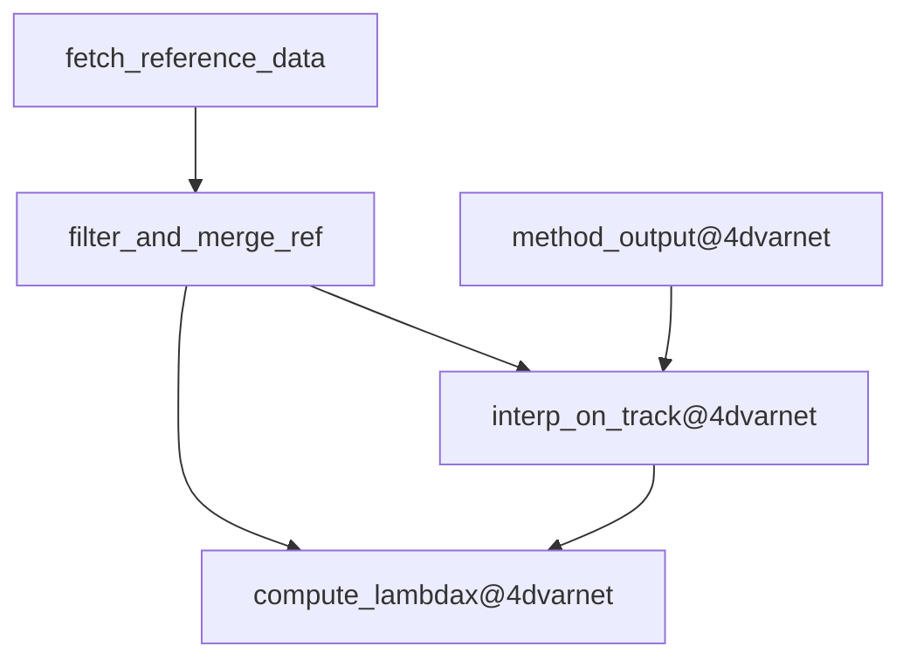

## Dag


## Environment setup
- clone the repo:
`git clone https://github.com/quentinf00/my_ocb.git`
`cd my_ocb`

- install the conda environment:
`mamba create -n q_ocb`
`mamba env update -f env.yaml`

## Reproducing data and metrics

- install datachallenge specific dependencies:
```
pip install pipeline.txt
```
- run dag:
```
dvc --cd datachallenges/dc_ose_2021 repro
```

## Development

### Changing the source code:
- For development, you want to install the dependencies as "editable" so that change in the source code are taken into account:
```
pip install -q -e modules/qf_interp_grid_on_track
pip install -q -e modules/dz_download_ssh_tracks
pip install -q -e modules/qf_filter_merge_daily_ssh_tracks
pip install -q -e modules/alongtrack_lambdax
pip install -q -e modules/dz_alongtrack_mu
pip install -q --no-deps -e pipelines/qf_alongtrack_metrics_from_map
```

- update the versions (# TODO)

### Update the config:
- Update values in `stage_configs.yaml`
if you want to reset the config to the default pipeline use:
  `qf_alongtrack_metrics_from_map --cfg job  > datachallenges/dc_ose_2021/stage_configs.yaml`

#TODO: improve config update (do not lose previous updates) àréfléchir

### Updating the dag
- specify in the `dvc.yaml` the stages dependencies, outputs, and command
- update the dag in the readme with `dvc dag compute_lambdax@0 --mermaid`
