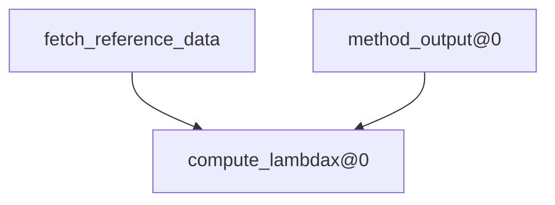

## Dag


## Dev (editable) Install
- clone repo:
`git clone https://github.com/quentinf00/my_ocb.git`
`cd my_ocb`
- install env:
`mamba create -n q_ocb`
`mamba env update -f env.yaml`
- install modules:
```
pip install -q -e modules/qf_interp_grid_on_track
pip install -q -e modules/dz_download_ssh_tracks
pip install -q -e modules/qf_filter_merge_daily_ssh_tracks
pip install -q -e modules/alongtrack_lambdax
```
- install pipeline:
```
pip install -q --no-deps -e pipelines/qf_alongtrack_lambdax_from_map
```


- run dag:
```
dvc --cd datachallenges/dc_ose_2021 repro
```
generate `stage_configs.yaml`
`qf_alongtrack_lambdax_from_map --cfg job  > datachallenges/dc_ose_2021/stage_configs.yaml`

Repro:
`dvc --cd datachallenges/dc_ose_2021 --verbose repro`
